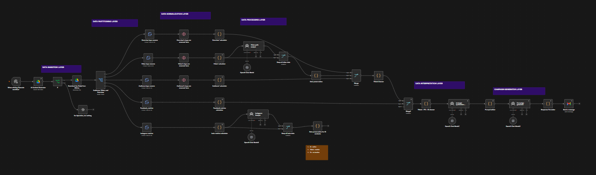

# Metric-Based AI Content Strategy & Campaign Generator

An automated analytics and strategy pipeline that operates as a digital marketing analyst. This system ingests cross-platform social media metrics, normalizes the raw data, uses LLMs to synthesize strategic insights, and automatically generates data-driven content campaigns.

Instead of manually exporting CSVs and guessing what content works, this system connects your data storage, processes multi-platform performance metrics (Instagram, Facebook, TikTok), and acts on that data to build targeted campaign proposals.

---

## Automated Workflow Execution

The pipeline is structured into distinct, sequential data layers. Upon execution, the automation extracts raw reports, structures the data, hands it off to specialized AI analysts for interpretation, and compiles a final strategic campaign delivered straight to your inbox.

---

## Project Overview

This project demonstrates how to build an advanced ETL (Extract, Transform, Load/Interpret) marketing pipeline using workflow automation, LLM APIs (e.g., OpenAI), and cloud storage. 

Each execution follows a highly structured data flow:
*   **Data Ingestion Layer:** The workflow triggers and automatically fetches the latest raw metrics files (Audience, Video, and Overview data) from Google Drive.
*   **Data Partitioning & Normalization Layer:** The system routes data into platform-specific streams (Facebook, Instagram) and normalizes key values so the AI can read them cleanly.
*   **Data Processing Layer:** Specialized LLM nodes act as dedicated analysts (e.g., "Video push analyst", "Instagram Analyst") to evaluate the normalized metrics independently.
*   **Data Interpretation Layer:** A Strategic Synthesizer LLM merges the insights from TikTok, Facebook, and Instagram into a cohesive, cross-platform performance summary.
*   **Campaign Generator Layer:** A final LLM consumes the synthesized strategy to build a tailored marketing campaign, formats the response, and emails the final brief to stakeholders via Gmail.

---

## Pipeline Capabilities

*   **Cross-Platform Data Handling:** Capable of digesting and merging metrics from multiple social platforms simultaneously.
*   **Automated ETL Processing:** Replaces manual spreadsheet formatting by programmatically renaming keys and calculating metrics.
*   **Multi-Agent Analysis:** Uses distinct LLM prompts for different data streams before synthesizing a final conclusion.
*   **Actionable Output:** Doesn't just provide data summaries; it generates a complete, ready-to-execute campaign brief based on the hard numbers.

## Pipeline Architecture


---

## Tech Stack

| Component | Technology |
| --- | --- |
| **Automation Platform** | Workflow Automation Engine (n8n / Make) |
| **LLM Reasoning Engine** | OpenAI (Multiple Chat Models) |
| **Storage & Data Source** | Google Drive |
| **Delivery** | Gmail |

---

## Repository Structure

```text
.github/
    workflows/             # CI/CD pipelines
src/
    prompts/               # System prompts for analysts, synthesizer, and campaign generator
    data-samples/          # Mock CSV/JSON files for testing
assets/
    metric-based-ai-content-strategy-campaign-generator.png
docs/
    architecture.md        # System design and data flow
    setup-guide.md         # Instructions to run the pipeline
.gitignore
LICENSE
README.md
